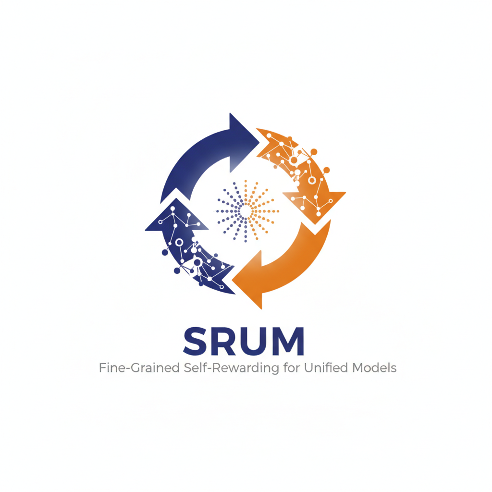
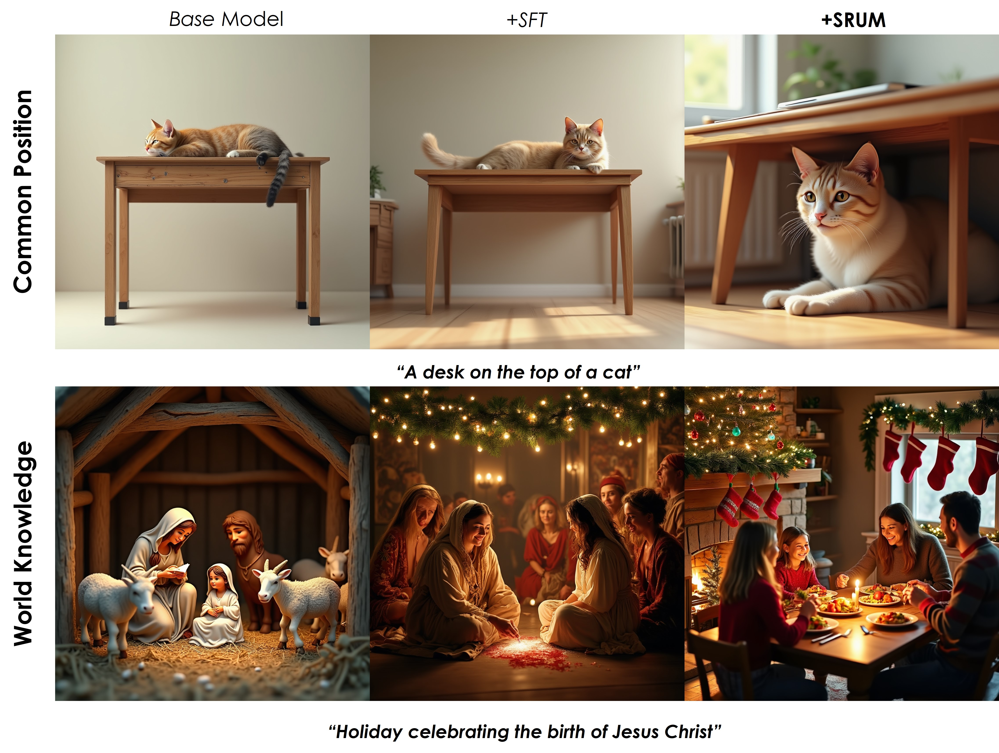

<p align="center">
  
</p>

<p align="center">
  <a href="https://bagel-ai.org/">
    
  </a>
  <a href="https://arxiv.org/abs/2505.14683">
    
  </a>
  <a href="https://huggingface.co/ByteDance-Seed/BAGEL-7B-MoT">
    
  </a>
  <a href="https://huggingface.co/spaces/ByteDance-Seed/BAGEL">
    
  </a>
</p>

# SRUM: Fine-Grained Self-Rewarding for Unified Models
> [Weiyang Jin*](https://github.com/WayneJin0918), [Yuwei Niu*](https://purshow.github.io/), Jiaqi Liao, [Chengqi Duan](https://scholar.google.com/citations?user=r9qb4ZwAAAAJ&hl=en), [Xihui Liu :email: ](https://xh-liu.github.io/)
>
> contact: xihuiliu@hku.hk
> 
> We present **SRUM**, a post-training reward fine-tuning method based on Unified Models (UMs) leverages UMs' inherent understanding capabilities to boost their generative abilities, bridging the gaps in performance caused by conflicts during the previous training phase. SRUM demonstrates exceptional generalization across both common positions and world knowledge..
The figure below showcases SRUM's qualitative performance compared with SFT and Base Model.

<p align="center"></p>


<!-- ## 🧠 Method
BAGEL adopts a Mixture-of-Transformer-Experts (MoT) architecture to maximize the model’s capacity to learn from richly diverse multimodal information. Following the same principle of capacity maximization, it utilizes two separate encoders to capture pixel-level and semantic-level features of an image. The overall framework follows a Next Group of Token Prediction paradigm, where the model is trained to predict the next group of language or visual tokens as a compression target.

BAGEL scales MoT’s capacity through Pre-training, Continued Training, and Supervised Finetuning on trillions of interleaved multimodal tokens spanning language, image, video, and web data. It surpasses open models on standard understanding and generation benchmarks and demonstrates advanced in-context multimodal abilities like free-form image editing, future frame prediction, 3D manipulation, world navigation, and sequential reasoning.

<p align="center"></p>


## 🌱 Emerging Properties
<p align="center"></p>

As we scale up BAGEL’s pretraining with more multimodal tokens, we observe consistent performance gains across understanding, generation, and editing tasks. Different capabilities emerge at distinct training stages—multimodal understanding and generation appear early, followed by basic editing, while complex, intelligent editing emerges later. This staged progression suggests an emergent pattern, where advanced multimodal reasoning builds on well-formed foundational skills. Ablation studies further show that combining VAE and ViT features significantly improves intelligent editing, underscoring the importance of visual-semantic context in enabling complex multimodal reasoning and further supporting its role in the emergence of advanced capabilities. -->

## 📢 News

We sincerely thank all contributors from the open community for their valuable support.

- **Sept. 25, 2025:** We released the official [website](https://bagel-ai.org/), [model](https://huggingface.co/ByteDance-Seed/BAGEL-7B-MoT), and [report](https://arxiv.org/abs/2505.14683) for SRUM.


## 📮 Notice
<!-- **Call for Bad Cases:** If you have encountered any cases where the model performs poorly, we would greatly appreciate it if you could share them in the [issue#11](https://github.com/ByteDance-Seed/Bagel/issues/11) or [Discord](https://discord.gg/Z836xxzy). -->
Follow the Bagel's original settings, you should focus:

**About Inference Hyperparameters:**
- **`cfg_text_scale`:** Controls how strongly the model follows the text prompt. `1.0` disables text guidance. Typical range: `4.0–8.0`.
- **`cfg_image_scale`:** Controls how much the model preserves input image details. `1.0` disables image guidance. Typical range: `1.0–2.0`.
- **`cfg_interval`:** Fraction of denoising steps where CFG is applied. Later steps can skip CFG to reduce computation. Typical: `[0.4, 1.0]`.
- **`timestep_shift`:** Shifts the distribution of denoising steps. Higher values allocate more steps at the start (affects layout); lower values allocate more at the end (improves details).
- **`num_timesteps`:** Total denoising steps. Typical: `50`.
- **`cfg_renorm_min`:** Minimum value for CFG-Renorm. `1.0` disables renorm. Typical: `0`.
- **`cfg_renorm_type`:** CFG-Renorm method:  
  - `global`: Normalize over all tokens and channels (default for T2I).
  - `channel`: Normalize across channels for each token.
  - `text_channel`: Like `channel`, but only applies to text condition (good for editing, may cause blur).
- **If edited images appear blurry, try `global` CFG-Renorm, decrease `cfg_renorm_min` or decrease `cfg_scale`.**


## 🔥 Quick Start

1️⃣  Set up environment
```bash
git clone https://github.com/WayneJin0918/SRUM
cd SRUM
conda env create -f environment.yaml
```

2️⃣  Download Bagel pretrained or our SRUM checkpoint
```python
from huggingface_hub import snapshot_download

save_dir = "models/BAGEL-7B-MoT"
repo_id = "ByteDance-Seed/BAGEL-7B-MoT"
cache_dir = save_dir + "/cache"

snapshot_download(cache_dir=cache_dir,
  local_dir=save_dir,
  repo_id=repo_id,
  local_dir_use_symlinks=False,
  resume_download=True,
  allow_patterns=["*.json", "*.safetensors", "*.bin", "*.py", "*.md", "*.txt"],
)

```

<!-- 3️⃣ Use Gradio WebUI to start playing with BAGEL!
```bash
# For 32GB+ VRAM GPU or multi GPUs.
python app.py
```

```bash
# For 12~32GB VRAM GPU, recommend using NF4 quantization. And use Chinese interface.
python app.py --mode 2 --zh
```

```bash
# For 22~32GB VRAM GPU, not recommended to use INT8 quantization.
python app.py  --mode 3
``` -->

## 🔥 Train & Eval

### Train

```bash
bash scripts/train.sh
```

You can replace the variables in the script with your own before running. 
See [TRAIN](TRAIN.md) for more details.

### Eval
We provide the scripts for evaluating VLM, T2I and Editing benchmarks. 
Please See [EVAL](EVAL.md) for more details.


## 📊 Benchmarks

### 1. Common Position

| T2I Model | 3d spatial | Color | Complex | Nonspatial | Numeracy | Shape | Spatial | Texture | Overall |
|-------|-----------|-------|---------|------------|----------|-------|---------|---------|---------|
| FLUX.1-dev | 76.39 | 90.63 | 83.51 | 87.47 | 75.30 | 80.20 | 84.23 | 87.07 | 83.10 |
| FLUX.1-schnell | 79.38 | 84.53 | 81.96 | 85.55 | 72.82 | 82.20 | 85.49 | 86.38 | 82.29 |
| SD-3-medium | 77.83 | 91.63 | 84.73 | 86.12 | 72.80 | 83.72 | 88.20 | 89.03 | 84.26 |
| SD-xl-base-1 | 72.25 | 77.75 | 75.00 | 85.28 | 57.14 | 72.18 | 77.08 | 78.38 | 74.38 |
| Qwen-image | 88.23 | 93.57 | 91.48 | 91.31 | 87.40 | 89.42 | 89.35 | 92.50 | 90.41 |

| Unified Model | 3d spatial | Color | Complex | Nonspatial | Numeracy | Shape | Spatial | Texture | Overall |
|-------|-----------|-------|---------|------------|----------|-------|---------|---------|---------|
| Janus-Pro | 76.17 | 84.25 | 80.28 | 80.47 | 56.43 | 65.14 | 79.67 | 69.67 | 74.01 |
| Show-o2 | 88.61 | 87.73 | 87.88 | 85.91 | 69.74 | 73.99 | 86.60 | 82.17 | 82.83 |
| BLIP3o | 81.73 | 89.92 | 85.55 | 84.78 | 71.67 | 83.75 | 92.47 | 87.45 | 84.66 |
| OmniGen2 | 82.21 | 92.22 | 86.87 | 88.51 | 72.00 | 83.95 | 90.07 | 90.88 | 85.84 |
| Bagel | 77.98 | 89.30 | 83.32 | 85.03 | 70.40 | 81.94 | 81.52 | 87.93 | 82.18 |
| Bagel (CoT) | 84.66 | 88.85 | 86.10 | 85.64 | 75.36 | 84.33 | 82.71 | 88.07 | 84.46 |
| BLIP3o+SRUM | 83.78↑ | 90.22↑ | 86.57↑ | 85.10↑ | 74.52↑ | 85.44↑ | 93.88↑ | 86.52↓ | 85.75↑ |
| OmniGen2+SRUM | 84.39↑ | 92.00↓ | 87.82↑ | 88.14↓ | 72.95↑ | 83.35↓ | 90.67↑ | 90.65↓ | 86.25↑ |
| Bagel+SRUM | 83.10↑ | 92.90↑ | 88.69↑ | 88.47↑ | 78.52↑ | 84.23↑ | 86.92↑ | 89.57↑ | 86.55↑ |
| ** Bagel+SRUM (CoT) **| 88.60↑ | 92.90↑ | 91.31↑ | 90.48↑ | 80.12↑ | 84.47↑ | 89.93↑ | 89.15↑ | 88.37↑ |


## ✍️ Citation

```bibtex
@article{deng2025bagel,
  title   = {SRUM: Fine-Grained Self-Rewarding for Unified Models},
  author  = {Jin, Weiyang and Niu, Yuwei and Liao, Jiaqi and Duan, Chengqi and Liu, Xihui},
  journal = {arXiv preprint arXiv:2509.xxxx},
  year    = {2025}
}
```


## 📜 License
BAGEL is licensed under the Apache 2.0.
